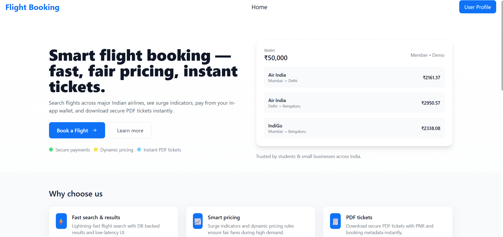
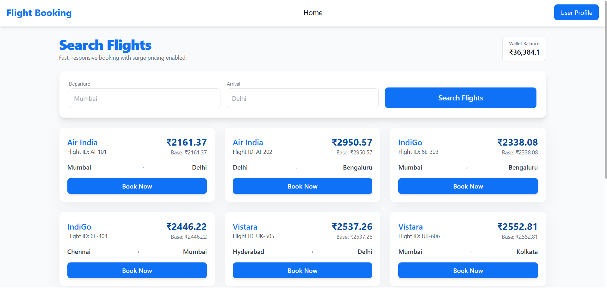
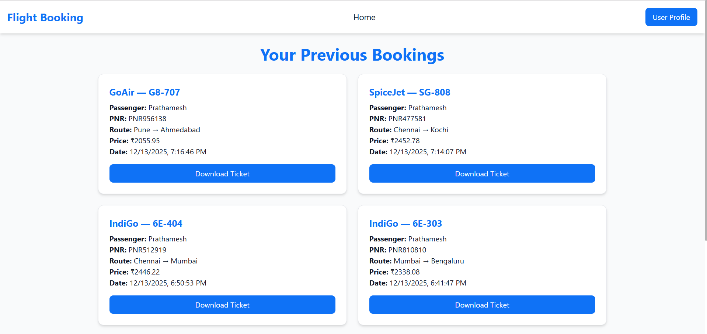

# ✈️ Flight Booking System – Full Stack Application

A **database-driven Flight Booking System** built using **FastAPI, React, and MySQL**, featuring **dynamic surge pricing**, **wallet-based payments**, **PDF ticket generation**, and **booking history management**.

---

## 🚀 Key Features

- 🔍 Database-driven flight search (no static JSON or external APIs)
- 📈 Dynamic pricing engine (surge pricing)
- 💰 Wallet-based payment system
- 🎟️ PDF ticket generation after booking
- 📜 Booking history with ticket re-download
- 🔐 Basic authentication (Login / Register)
- 🎨 Responsive UI with Tailwind CSS

---

## 🖼️ Application Screenshots

Place all screenshots inside a folder named `screenshots/` in the project root.

### 🏠 Home Page

### 🔍 Flight Search

### 📜 Booking History

### 🎟️ Ticket PDF Generation

---

## 🧠 System Architecture

Frontend (React + Tailwind CSS)
|
| REST API
↓
Backend (FastAPI)
|
↓
Database (MySQL)

---

## 🛠️ Tech Stack

### Frontend
- React (Vite)
- React Router DOM
- Tailwind CSS
- Axios
- Context API

### Backend
- FastAPI
- SQLAlchemy ORM
- MySQL
- Pydantic v2
- Uvicorn

### Utilities
- ReportLab (PDF generation)
- Passlib + Bcrypt
- python-dotenv

---

## 📦 Database Design

### Flights Table

| Field | Description |
|------|------------|
| flight_id | Flight code |
| airline | Airline name |
| departure_city | Source city |
| arrival_city | Destination city |
| base_price | ₹2000–₹3000 |

### Users Table

| Field | Description |
|------|------------|
| username | User name |
| email | User email |
| password_hash | Encrypted password |
| wallet_balance | Wallet amount |

### Bookings Table

| Field | Description |
|------|------------|
| pnr | Unique booking reference |
| passenger_name | Passenger |
| flight_id | Linked flight |
| user_id | Linked user |
| final_price | Price paid |
| booking_time | Date & time |

---

## 📈 Dynamic Pricing Logic

- If a flight is attempted **3 times within 5 minutes**
- Price increases by **10%**
- Surge remains active for **10 minutes**
- After that, price resets to base price

---

## 💰 Wallet System

- Default wallet balance: **₹50,000**
- Wallet deducted on successful booking
- Booking blocked if balance is insufficient
- Wallet updates in real time

---

## 🎟️ PDF Ticket Generation

Each successful booking generates a downloadable **PDF ticket** containing:

- Passenger name
- Airline & Flight ID
- Route (Departure → Arrival)
- Final price paid
- Booking date & time
- Unique PNR

Tickets can be **downloaded again** from the Booking History page.

---

## 📜 Booking History

- Displays all previous bookings
- Shows flight details, price, date, and PNR
- Ticket download available for each booking
- Data fetched directly from the database

---

## 🔐 Authentication

- Login and Register functionality
- Password hashing using **bcrypt**
- User-specific booking history and wallet

---

## 🧪 How to Run Locally

### 1️⃣ Clone Repository

git clone https://github.com/<your-username>/flight-booking-system.git
cd flight-booking-system

### 2️⃣ Backend Setup

cd backend
python -m venv venv
venv\Scripts\activate    # Windows

# Install dependencies:

pip install -r requirements.txt

# Create .env file using .env.example:

DB_USER=root
DB_PASSWORD=your_mysql_password
DB_HOST=localhost
DB_PORT=3306
DB_NAME=flight_booking_db

# Run backend server:

uvicorn app.main:app --reload --port 8000

# Backend runs at:

http://127.0.0.1:8000

### 3️⃣ Frontend Setup

cd frontend
npm install
npm run dev

# Frontend runs at:

http://localhost:5173

### 📄 API Endpoints (Sample)
Method	Endpoint
GET	/flights
POST	/bookings
GET	/bookings?user_id=ID
GET	/bookings/ticket/{pnr}
POST	/users/login
POST	/users/register

### 👤 Author
# Prathamesh Sangole
# CSE (Artificial Intelligence)
